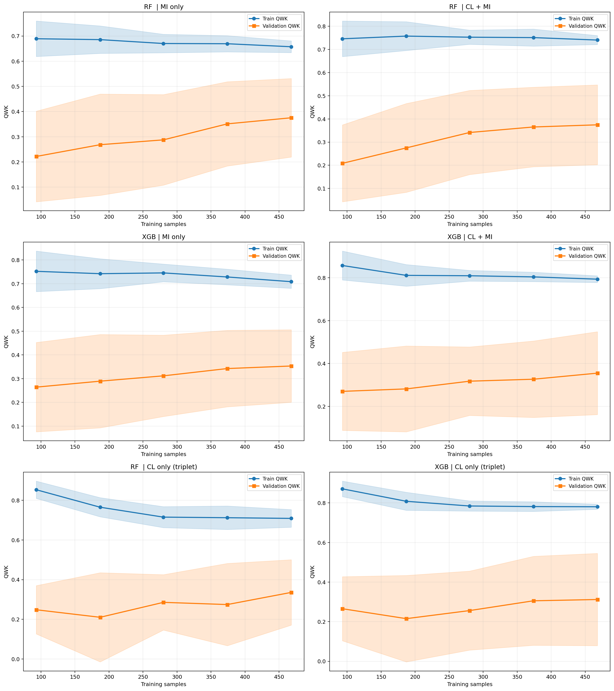
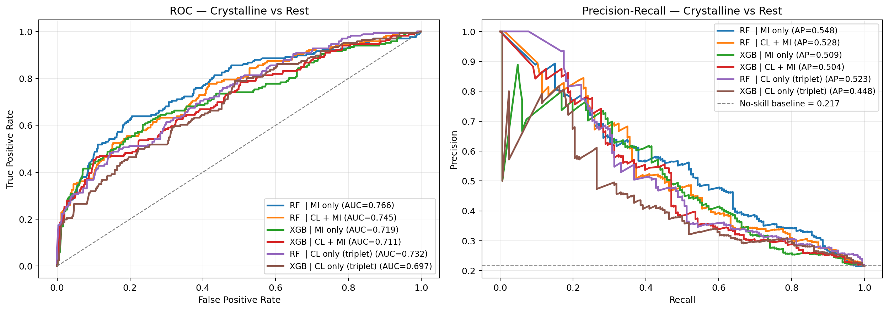
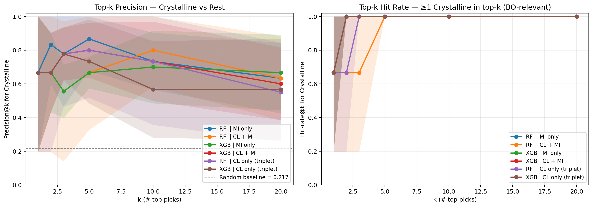
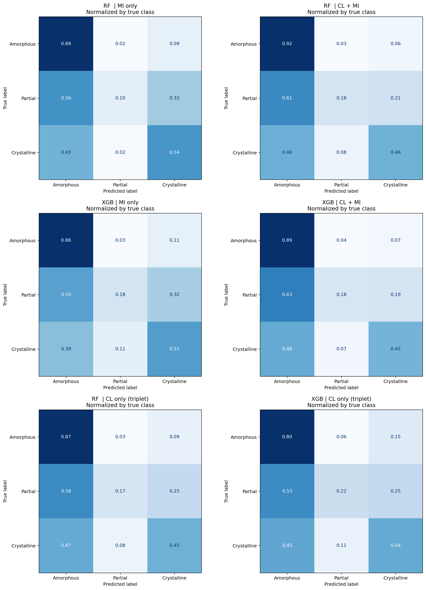

# LVMOF-Surrogate: A Machine Learning Pipeline for Low-Valent MOF Synthesis Prediction

A machine learning surrogate model for predicting the crystallinity outcome of Low-Valent Metal-Organic Framework (LVMOF) synthesis experiments, built to guide Bayesian Optimization toward novel, high-crystallinity MOF conditions. The pipeline trains ordinal classifiers on ~750 historically-run lab experiments, combining molecular fingerprints, physicochemical descriptors, and process variables, then uses cross-validated feature selection and hyperparameter tuning to rank candidate synthesis conditions for experimental prioritization. While absolute three-class accuracy is moderate (cross-validated QWK ≈ 0.2–0.4, reflecting the small dataset and label noise), the surrogate ranks crystalline candidates above amorphous ones reliably enough to drive Bayesian Optimization, which requires only correct ranking, not exact prediction.

---

## Chemical Problem and Motivation

Metal-Organic Frameworks (MOFs) are porous crystalline materials with applications in gas storage, drug delivery, catalysis, and chemical sensing. **Low-valent MOFs (LVMOFs)** — built from electron-rich, low-oxidation-state metal centers (e.g., Pd(0), Rh(I), Ir(I)) — represent a particularly challenging and underexplored class. Their synthesis is notoriously difficult to reproduce: slight changes in solvent ratio, temperature, ligand sterics, or metal-to-linker stoichiometry can shift the product from fully crystalline to completely amorphous.

Historically, the Cohen Lab at UCSD has run hundreds of LVMOF synthesis experiments, accumulating a dataset that includes both successes and failures. However, because the chemical space of precursors, linkers, modulators, and process conditions is combinatorially large, **trial-and-error experimentation is slow and expensive**. A data-driven surrogate model that can predict crystallinity from molecular and process descriptors — even approximately — can meaningfully accelerate discovery by steering Bayesian Optimization toward the most promising synthesis conditions before committing lab resources.

---

## Data Sources

**Primary dataset:** ~750 historical LVMOF synthesis experiments run in the Cohen Lab, stored in `data/Experiments_with_Calculated_Properties_no_linker.xlsx`. Each row represents one synthesis attempt and includes:

- **Target:** PXRD crystallinity score (0–9 continuous, remapped to 3 ordinal classes: 0 = Amorphous ≤ 2, 1 = Partial 3–5, 2 = Crystalline ≥ 6)
- **Chemical identity:** SMILES strings for metal precursor, linker(s), and modulator
- **Process variables** (conditions set by the experimentalist):

| Variable | Description |
|---|---|
| `equivalents` | Molar equivalents of linker relative to metal |
| `temperature_k` | Reaction temperature (Kelvin) |
| `reaction_hours` | Reaction duration |
| `metal_over_linker_ratio` | Metal-to-linker molar ratio |
| `total_solvent_volume_ml` | Total solvent volume |
| `solvent_1/2/3_fraction` | Volume fractions of each solvent component |
| `metal_conc`, `linker_conc`, `mod_conc`, `total_conc` | Component concentrations |
| `Mix_M0_Area`, `Mix_M1_NetCharge`, `Mix_M2_Polarity`, `Mix_M3_Asymmetry`, `Mix_M4_Kurtosis` | COSMO-RS sigma-profile moments of the solvent mixture |
| `Mix_M_HB_Acc`, `Mix_M_HB_Don` | Mixture H-bond acceptor/donor capacity |
| `Mix_f_nonpolar`, `Mix_f_acc`, `Mix_f_don`, `Mix_sigma_std` | COSMO surface fractions and σ-profile spread |
| `Mix_Vcosmo`, `Mix_lnPvap` | Mixture molecular volume and log vapor pressure |
| `reaction_hours_missing`, `temperature_k_missing` | Missingness indicator flags |

The dataset includes **both positive (crystalline) and negative (amorphous) outcomes**, which is crucial for building a discriminative model. Class imbalance is addressed with SMOTE oversampling during training.

---

## Computational Approach and Model / Workflow Overview

### Feature Engineering

The pipeline constructs a high-dimensional feature matrix (>10,000 raw features) from the molecular structures and process variables, assembled from 12 descriptor blocks:

| Block | Source | Key Content |
|---|---|---|
| Metal center (A) | `mendeleev` + heuristics | Electronegativity, radii, oxidation state, d-electron count, geometry |
| Co-ligand inventory (B) | RDKit + lookup tables | Halide counts, CO/phosphine sigma/pi parameters, net charge |
| Complex-level (C) | RDKit | Coordination number, dimer flags, precursor charge, ligand diversity |
| Mordred RAC descriptors | `mordred` | Topological autocorrelation over all precursor and modulator ligands |
| Physicochemical | RDKit Descriptors | MW, LogP, TPSA, rotatable bonds, H-bond donors/acceptors |
| TEP (Tolman Electronic Parameter) | Pre-trained LGBMRegressor | Phosphine electronic donation strength for linkers, modulators, precursors |
| Steric descriptors | `morfeus` | Cone angle, %V_bur (buried volume) for phosphines |
| ChemBERTa-2 embeddings | `DeepChem/ChemBERTa-77M-MTR` | 384-dim transformer CLS token for linker and modulator SMILES |
| Extended RDKit | RDKit SMARTS | MOF-relevant functional group counts (COOH, pyridyl-N, etc.) |
| 3D shape descriptors | RDKit ETKDGv3 | PMI, asphericity, eccentricity, spherocity, radius of gyration |
| TTP / G14 hub topology | Custom graph traversal | Tetratopic linker arm geometry, hub element identity, P-arm count |
| DRFP reaction fingerprint | `drfp` | 2048-bit reaction fingerprint encoding precursor + linker + modulator |

Process variables and their pairwise interactions (temperature × metal ratio, temperature × reaction time, etc.) are concatenated into the final feature matrix.

### Dimensionality Reduction

1. **Variance Threshold:** Removes zero-variance features from the full feature matrix
2. **Mutual Information (MI) Feature Selection:** `AdaptiveSelectKBest` computes MI scores with a discrete/continuous feature mask (fingerprints and OHE features use the entropy estimator; continuous descriptors use the KNN estimator). Stratified budgets are applied separately to discrete (MI_K) and continuous (MI_K_CONTINUOUS) features to prevent KNN-MI inflation artifacts on small datasets
3. **SMOTE:** Oversampling of Partial (class 1) and Crystalline (class 2) minority classes inside each training fold (never on validation data)

### Cross-Validation Strategy

`RepeatedStratifiedGroupKFold` with groups assigned by KMeans on a 2D UMAP embedding of the MI-filtered feature view. Group count is swept over k ∈ [8, 30) and selected by maximizing silhouette score subject to ≥ 5 crystalline samples per validation fold. Optuna tuning uses 1 repeat (3 fits/trial); final evaluation uses 5 repeats (15 fits) for stable estimates.

### Models

Six pipeline variants are trained and compared:

| Pipeline | Feature Transform | Classifier |
|---|---|---|
| RF \| MI only | MI feature selection | Frank-Hall Ordinal RF |
| RF \| CL + MI | Triplet CL embedding + MI | Frank-Hall Ordinal RF |
| RF \| CL only | Triplet CL embedding only | Frank-Hall Ordinal RF |
| XGB \| MI only | MI feature selection | Frank-Hall Ordinal XGBoost |
| XGB \| CL + MI | Triplet CL embedding + MI | Frank-Hall Ordinal XGBoost |
| XGB \| CL only | Triplet CL embedding only | Frank-Hall Ordinal XGBoost |

**Frank-Hall Ordinal Classification** decomposes the 3-class ordinal problem into K-1 = 2 binary classifiers: P(y > 0) and P(y > 1). Class probabilities are recovered from cumulative probability differences.

**Triplet Contrastive Learning** pre-trains an MLP encoder on crystalline anchors vs. partial negatives, learning an embedding space that clusters crystalline outcomes. The embedding is optionally concatenated to the original features before MI selection.

**Hyperparameter tuning** is performed with Optuna (100 trials per variant, TPE sampler, maximizing cross-validated QWK).

### Primary Metric

**QWK (Quadratic Weighted Kappa):** penalizes misclassifications proportionally to the squared ordinal distance. More informative than accuracy for imbalanced ordinal problems.

---

## Route Design and What Was Completed

- [x] Data loading, SMILES cleaning, inventory merge, and missingness imputation
- [x] Full featurization pipeline: 12 descriptor blocks assembled into a single feature matrix
- [x] Discrete/continuous feature mask construction for correct MI estimation
- [x] Variance threshold + stratified MI feature selection with separate discrete/continuous budgets
- [x] UMAP + KMeans group assignment for leak-resistant cross-validation
- [x] Triplet contrastive learning encoder (MLP with cosine-annealed Adam, balanced batch sampling)
- [x] Frank-Hall ordinal classification wrapper for RF and XGBoost
- [x] SMOTE oversampling inside CV folds (no leakage)
- [x] Optuna hyperparameter tuning (6 pipeline variants × 100 trials)
- [x] Evaluation: QWK, MAE, Within-1 accuracy, exact accuracy
- [x] ROC / PRC curves per class, learning curves, normalized confusion matrices
- [x] SHAP feature importance analysis (bar, beeswarm, grouped by descriptor block)
- [x] Checkpoint system (data.pkl, best_params.pkl, optuna.db) for resumable runs
- [x] Bayesian Optimization loop: LFBO-EI / LFBO-SSL / EI / Thompson Sampling acquisitions, pool-based retrospective simulation, multi-seed evaluation, leave-one-cluster-out (LOCO) validation, surrogate calibration checks, and recommendation mode for new experiments

---

## Results Summary

### Model Comparison

The RF | MI + CL pipeline achieved the best balance of predictive performance and generalization, with the smallest gap between training and validation QWK, indicating minimal overfitting relative to the other variants. The surrogate is most effective at the ranking task that matters for BO — placing more crystalline candidates above less crystalline ones (see ROC/PRC and top-k precision results below). Contrastive learning augmentation did not consistently improve performance on this dataset size (~750 experiments), likely because the triplet encoder requires more data to learn a generalizable embedding.

### Learning Curves

Learning curves show training vs. cross-validated QWK as a function of training set size. The RF | MI only pipeline (top-left) shows stable convergence with minimal train/validation gap, consistent with good generalization.



### ROC and Precision-Recall Curves

ROC and PRC curves are shown for all six pipeline variants for the Crystalline class (positive class = 2, prevalence ≈ 22.6%). The RF | MI only pipeline maintains competitive ROC-AUC and average precision relative to more complex variants.



### Top-k Precision

Top-k precision measures the fraction of true Crystalline outcomes among the k validation samples ranked highest by predicted crystallinity — the quantity that directly determines BO usefulness, since the optimizer only acts on the top of the ranking.



### Normalized Confusion Matrices

Row-normalized confusion matrices show the fraction of each true class predicted into each predicted class across all pipelines. The Partial class (class 1) is the hardest to predict due to its ambiguous boundary with both Amorphous and Crystalline outcomes and its intermediate representation in training data.



### SHAP Feature Importance (RF | MI only)

SHAP values for the RF | MI only model, aggregated over the top 15 features. Process variables (temperature, concentration, solvent properties) and metal-center descriptors dominate the top features, consistent with domain knowledge that synthesis conditions and metal identity are primary determinants of LVMOF crystallinity.


---

## Interpretation, Limitations, and Next Steps

### Interpretation

The RF | MI only model identifies temperature, metal concentration, solvent H-bond capacity, and metal-center electronic properties (d-electron count, electronegativity) as the most predictive features for LVMOF crystallinity. This aligns with the chemical intuition that LVMOF formation is governed by the kinetic and thermodynamic stability of low-valent metal complexes in solution, which is strongly modulated by solvent polarity and temperature. Linker geometry features (TTP hub topology, arm length) also appear, supporting the hypothesis that ligand rigidity and arm length critically determine whether a crystalline network can form.

### Limitations

- **Small dataset (N ≈ 750):** The primary limitation is dataset size. With ~750 experiments and significant class imbalance (Amorphous dominant), the model has limited statistical power, particularly for the minority Partial class which is rarely predicted. Cross-validated QWK values in the range of 0.2–0.4 reflect genuine uncertainty rather than modeling failure.

- **Predictive accuracy:** Absolute classification accuracy is moderate on the full three-class problem. The model is stronger at the task most critical for BO — **ranking more crystalline candidates above less crystalline ones** — as quantified by per-class ROC-AUC, average precision, and top-k precision. Bayesian Optimization only requires the surrogate to *rank* candidate conditions by predicted crystallinity, not to predict exact outcomes.

- **Partial class imbalance:** The Partial crystallinity class (PXRD score 3–5) is underrepresented and physically ambiguous. Its boundary with Amorphous and Crystalline is soft, introducing label noise.

- **Generalization to novel chemistry:** The model is trained on experiments from a specific subset of LVMOF chemistry (Group 9–11 metals, phosphine/CO ligands). Predictions for significantly out-of-distribution chemical spaces may be unreliable.

### Next Steps

1. **Run the experimental BO loop:** The BO framework (`bo_core.py`, `bo_metrics.py`) implements LFBO-EI, LFBO-SSL, EI, and Thompson Sampling acquisitions with retrospective validation (multi-seed, per-cluster, and LOCO). The next step is the prospective loop: generate candidate conditions → synthesize top candidates → update the dataset → refit the surrogate.

2. **Expand the dataset:** Each new experimental cycle adds data to the historically underrepresented Partial and Crystalline classes, improving the surrogate over time (active learning effect).

3. **Improve the surrogate:** Evaluate ensemble surrogates, Gaussian Processes, or neural network-based surrogates (e.g., Bayesian neural networks) as the dataset grows. The current RF/XGB surrogates are appropriate for N ~ 1000 but may be superseded as data accumulates.

4. **Multi-objective BO:** Extend from single-objective (crystallinity) to multi-objective optimization incorporating pore size, surface area, or stability metrics once structural characterization data becomes available.

---

## Reproducibility Instructions

### Requirements

- Python 3.10+
- See `requirements.txt` for pinned dependencies

### Installation

```bash
chmod +x install.sh && ./install.sh
```

> **Note:** `mordred` declares `numpy < 2.0` but works with `numpy 2.0.2` after a small compatibility shim applied at import time in `featurization.py`. `install.sh` installs `mordred` with `--no-deps` and pins `numpy==2.0.2` and `pandas==2.2.2` to keep the resolver from downgrading them — use `install.sh` rather than installing `requirements.txt` directly.

### Running the Pipeline

```bash
# Full run: featurize, tune, evaluate, SHAP
python main.py

# Run with a custom data file
python main.py --data path/to/data.xlsx

# Skip Optuna tuning — re-evaluate with existing checkpointed hyperparams
python main.py --skip-tuning

# Bayesian Optimization — simulation mode (evaluates BO on historical data)
python main.py --bo --bo-mode simulate

# Bayesian Optimization — recommendation mode (generates new experiment candidates)
python main.py --bo --bo-mode recommend --bo-precursor SMILES --bo-linker SMILES
```

### Checkpoint Behavior

- `checkpoints/data.pkl` — featurized dataset (reused across runs; delete to re-featurize)
- `checkpoints/best_params.pkl` — Optuna-tuned hyperparameters (reused; delete to re-tune)
- `checkpoints/optuna.db` — Optuna study database (trials resume from last completed)

Delete `data.pkl` and `optuna.db` when changing `MI_K`, `MI_K_CONTINUOUS`, or the discrete feature mask.

All plots (ROC/PRC, learning curves, confusion matrices, SHAP, MI cliff) are saved directly to the working directory as `.png` files without requiring any interactive window interaction. The pipeline runs fully non-interactively end-to-end.

### Reproducibility Seeds

All stochastic components are seeded with `SEED = 42`:

| Component | Mechanism |
|---|---|
| Optuna XGB & RF studies | `TPESampler(seed=42)` |
| `StratifiedGroupKFold` | `random_state=42` |
| `KMeans` (group selection & pre-VT) | `random_state=42` |
| `UMAP` embedding | `random_state=42` |
| `SMOTE` oversampling | `random_state=42` |
| `TripletTrainer` (contrastive learning) | `random_state=42` + seeded `torch.Generator` |
| `AdaptiveSelectKBest` (MI) | `random_state=42` |
| `RandomForestClassifier` | `random_state=42` |
| `XGBClassifier` | `random_state=42` (via `XGB_FIXED`) |

---

## File Structure

| File | Description |
|------|-------------|
| `main.py` | Entry point — orchestrates featurization, dimensionality reduction, Optuna tuning, evaluation, and Bayesian Optimization |
| `config.py` | All constants: `COLMAP`, `TARGET_METALS`, column lists, model hyperparameter keys, embedding dims, SOAP species, SMARTS patterns, BO settings |
| `data_processing.py` | Data loading, SMILES cleaning, inventory building, merge logic, missingness imputation, QA/audit functions |
| `featurization.py` | All featurization functions: metal descriptors, Morgan FP, Mordred RAC, TEP, morfeus sterics, ChemBERTa-2, G14 hub topology, TTP, DRFP, SOAP |
| `feature_assembly.py` | Assembles `X_final` from featurization outputs; `assemble_features()` entry point; `build_feature_catalog()` for SHAP name/group arrays; `build_discrete_mask()` for MI estimation |
| `dimensionality.py` | `VarianceThreshold`, KMeans OHE, mutual information diagnostic + cliff plot, UMAP embedding, KMeans group selection, `RepeatedStratifiedGroupKFold`, process variable interaction building |
| `models.py` | `FrankHallOrdinalClassifier`, `TripletTrainer`, `AdaptiveSelectKBest` (stratified MI), scoring metrics (`qwk_0_9`, `mae_0_9`, `within1`, `exact_acc`), pipeline factory functions |
| `pipeline.py` | Optuna objective functions for all 6 pipeline variants, `eval_pipe`, progress callbacks |
| `evaluation.py` | `plot_roc_prc`, `plot_learning_curves`, `plot_confusion_matrices`, `run_shap_featurized` |
| `bo_core.py` | BO loop — `BOLoop`, `CandidateFeaturizer`, acquisition functions (LFBO-EI, LFBO-SSL, EI, Thompson Sampling), `SearchSpace`, `TrustRegion`, `BOCheckpointer` |
| `bo_metrics.py` | BO simulation metrics (AF, EF, hit rate, simple regret, calibration) and visualization functions |
| `bo_featurize.py` | Featurizes novel candidate chemistries into the training feature space for recommend mode |
| `bo_gamma_sweep.py` | Sensitivity sweep over the LFBO elite-quantile gamma |
| `bo_tail_alpha_sweep.py` | Sensitivity sweep over the tail-weighting alpha |
| `bo_paired_compare.py` | Paired multi-seed comparison of two acquisition strategies on identical init splits |
| `bo_cluster_check.py` | Diagnostics for the SSL cluster assumption underlying LFBO-SSL |
| `cosmo_features.py` | COSMO-RS sigma-profile featurizer for solvent mixtures |
| `app/` | Streamlit web app (COMPASS): recommendations, result recording, model retraining |
| `requirements.txt` | Pinned Python dependencies (install via `install.sh`) |
| `docs/` | Generated BO evaluation figures and recommendation logs |

## Pipeline Overview

```
load_data → build_inventory → merge_data → fix_missingness
    ↓
assemble_features()   [feature_assembly.py]
    ↓
prepare_labels → remap_score (3-class: 0=Amorphous, 1=Partial, 2=Crystalline)
    ↓
build_discrete_mask()  [discrete/continuous flag per feature column]
    ↓
apply_variance_threshold → run_mi_diagnostic (stratified discrete+continuous)
    ↓
build_process_interactions → assemble_cv_matrix
    ↓
build_umap_embedding → select_kmeans_groups   [for CV stratification]
    ↓
Optuna tuning (100 trials per variant, TPE sampler, maximize QWK)
    ↓
Build 6 pipelines: RF|MI-only, RF|CL+MI, RF|CL-only, XGB|MI-only, XGB|CL+MI, XGB|CL-only
    ↓
eval_pipe (RepeatedStratifiedGroupKFold, 5 repeats × 3 folds = 15 fits)
    ↓
plot_roc_prc → plot_learning_curves → plot_confusion_matrices → run_shap_featurized
    ↓
[optional] BOLoop → simulate / recommend
```

### Pipeline step order (inside each cross-validation fold)

```
impute (median) → vt (VarianceThreshold) → [cl (TripletTrainer)] → mi (AdaptiveSelectKBest) → smote (SMOTE) → FrankHallOrdinalClassifier
```

## Featurization Block Summary

### 1. Metal Center Features (Block A)
**Source:** `mendeleev` + heuristic logic
Atomic number, period, group, electronegativity (Pauling/Allen), atomic/covalent/vdW radii, ionization energies, valence electrons, oxidation state, d-electron count, geometry flags (square planar, tetrahedral, octahedral).

### 2. Co-ligand Inventory (Block B)
**Source:** RDKit + Lookup Tables
Counts and properties of simple ligands (halides, CO, phosphines): sigma-donor/pi-acceptor parameters, net co-ligand charge.

### 3. Complex-level Descriptors (Block C)
**Source:** RDKit
Dimer/cluster flags, total coordination number, homoleptic status, estimated precursor charge, number of unique ligand types.

### 4. Revised Autocorrelation (RAC) Descriptors
**Source:** `mordred`
Weighted-sum autocorrelation (ATS, MATS, GATS) over all precursor ligands and modulators; missingness flags for unparseable ligands.

### 5. Physicochemical Descriptors
**Source:** `rdkit.Chem.Descriptors`
MW, LogP, TPSA, rotatable bonds, H-bond donors/acceptors, Hall-Kier alpha, aromatic ring count, Gasteiger partial charges.

### 6. Tolman Electronic Parameter (TEP)
**Source:** Pre-trained LGBMRegressor (Ess Lab)
Predicted TEP (cm⁻¹) for modulators, linkers, and precursor ligands; missingness flags.

### 7. Steric Descriptors
**Source:** `morfeus`
Exact Cone Angle and Percent Buried Volume (%V_bur) for phosphine linkers, modulators, and precursor ligands.

### 8. ChemBERTa-2 Embeddings
**Source:** `DeepChem/ChemBERTa-77M-MTR`
384-dimensional CLS token vector for linker and modulator SMILES.

### 9. Extended RDKit Descriptors
**Source:** RDKit SMARTS
BertzCT, LabuteASA, FractionCSP3, Chi/Kappa connectivity indices, MOF-relevant SMARTS counts (COOH, pyridyl-N, imidazole, phosphonate, etc.).

### 10. 3D Shape Descriptors
**Source:** RDKit ETKDGv3
PMI, NPR, Asphericity, Eccentricity, Spherocity Index, Radius of Gyration.

### 11. Tetratopic Phosphine (TTP) / G14 Hub Topology
**Source:** Custom graph traversal
Hub element identity (Si, Ge, Sn), arm length statistics, arm backbone type (alkyl/aryl/alkynyl), topicity (P-arm count), hub eccentricity.

### 12. Reaction Fingerprint (DRFP)
**Source:** `drfp`
2048-bit hashed reaction fingerprint encoding precursor + linker + modulator simultaneously.

## Contrastive Learning Notes

Triplet-based contrastive learning outperforms SupCon in this setting and is the preferred approach. Crystalline samples (class 2) serve as anchors and positives; Partial samples (class 1, hard negatives) or Amorphous (class 0, easy negatives) serve as negatives.

## Determinism Notes

All stochastic components are seeded (see table above), but bit-exact reproducibility across operating systems and BLAS builds is not guaranteed: UMAP, KMeans, and tree ensembles can produce slightly different results on different platforms, which propagates to the Optuna-selected hyperparameters. Reported results were obtained on Linux. To reproduce on another platform, delete `checkpoints/best_params.pkl` and `checkpoints/optuna.db` and re-run the tuning step.
